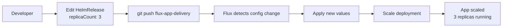

# Simple GitOps Change Workflow

## Scenario 1: Update Application Image

```mermaid
flowchart LR
    A[ ] Developer] --> B[ Edit values.yaml<br/>image: nginx:1.22]
    B --> C[ git push]
    C --> D[ Flux detects change<br/>every 1 minute]
    D --> E[ Flux pulls new chart]
    E --> F[ Deploy to GKE<br/>Rolling update]
    F --> G[ App updated<br/>nginx:1.22 running]
```

**Steps:**
1. Developer changes image tag in sample-app-helm-chart repository
2. Git push triggers change detection
3. Flux automatically pulls and deploys the update
4. Application runs with new image version

## Scenario 2: Override via GitOps Config



**Steps:**
1. Developer updates HelmRelease values in flux-app-delivery repository
2. Git push triggers Flux reconciliation
3. Flux applies the configuration override
4. Application scales to desired replica count
