# Flux App Delivery - Simple Flow

```mermaid
flowchart LR
    A[📁 GitRepository<br/>sample-app-helmrepository.yaml] --> B[📁 HelmRelease<br/>sample-app-helmrelease.yaml]
    B --> C[🚀 App Deployed<br/>in sample-app namespace]
    
    D[🌐 External Helm Chart<br/>github.com/paraskanwarit/sample-app-helm-chart] --> B
    E[📁 Namespace<br/>sample-app-namespace.yaml] --> C
```

## What Each File Does

**GitRepository:** Tells Flux where to find the Helm chart (external GitHub repo)

**HelmRelease:** Tells Flux how to deploy the chart (version, values, namespace)

**Namespace:** Creates the target namespace for the application

**Result:** Flux automatically deploys the sample app using the external Helm chart
